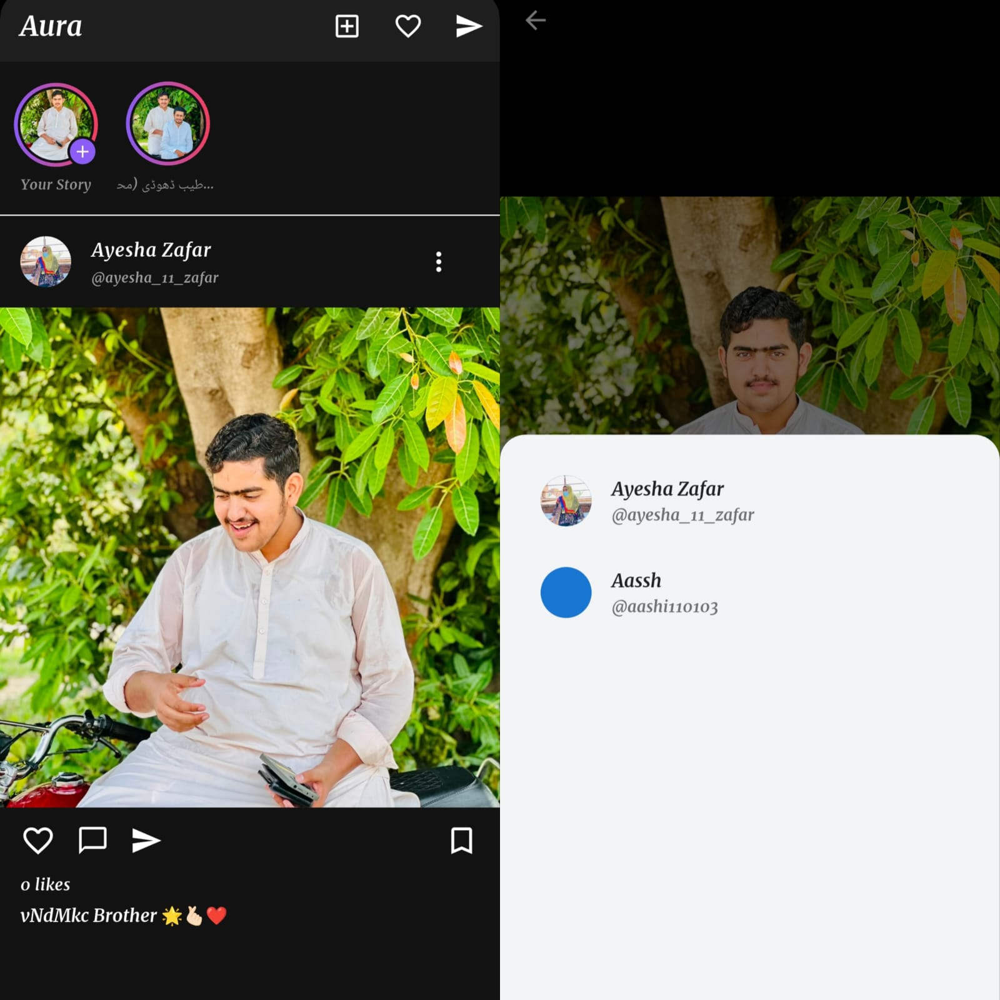
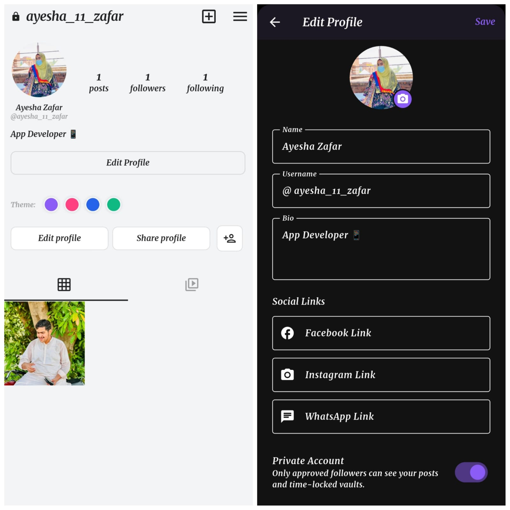
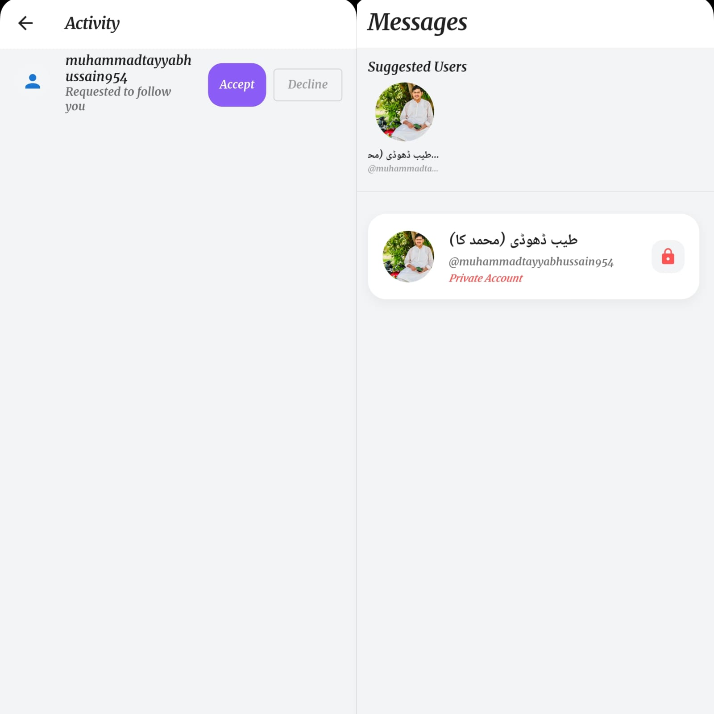
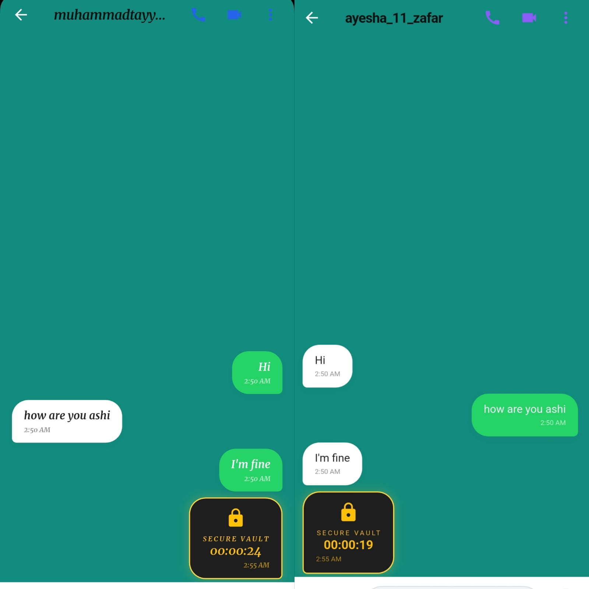
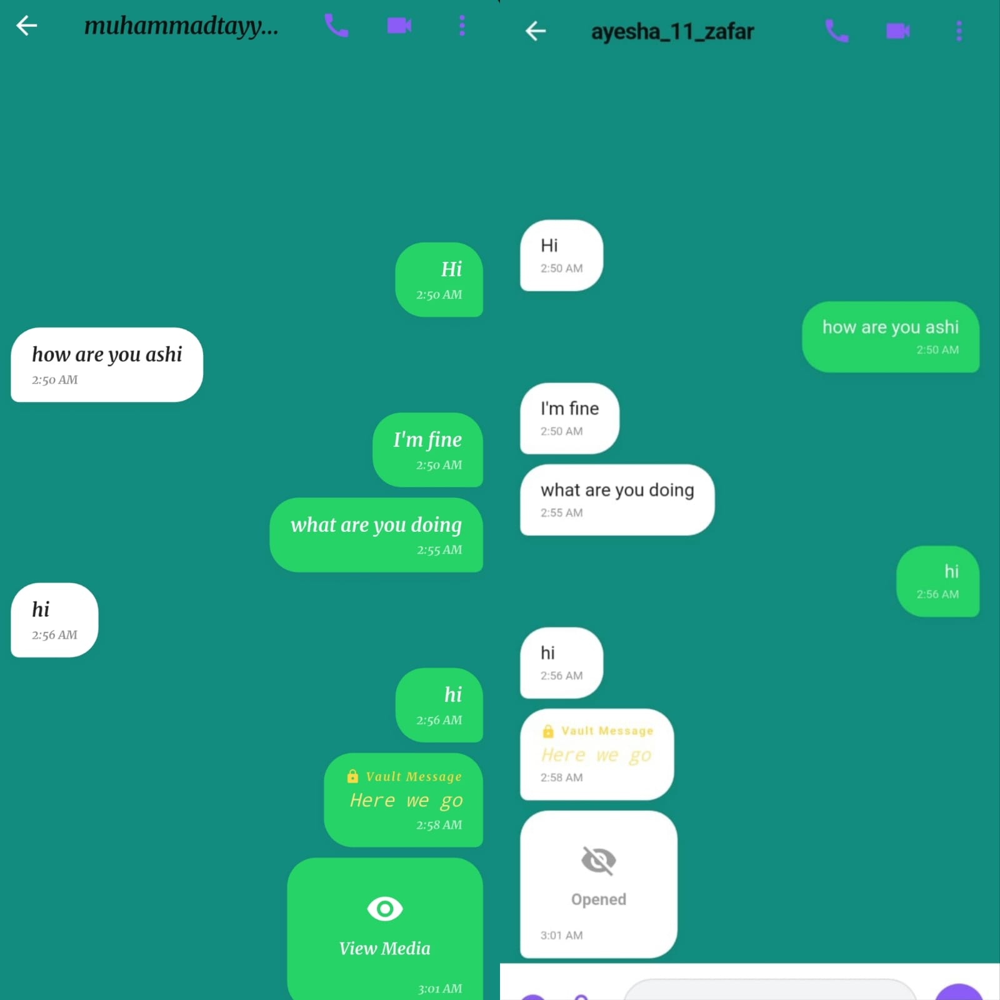
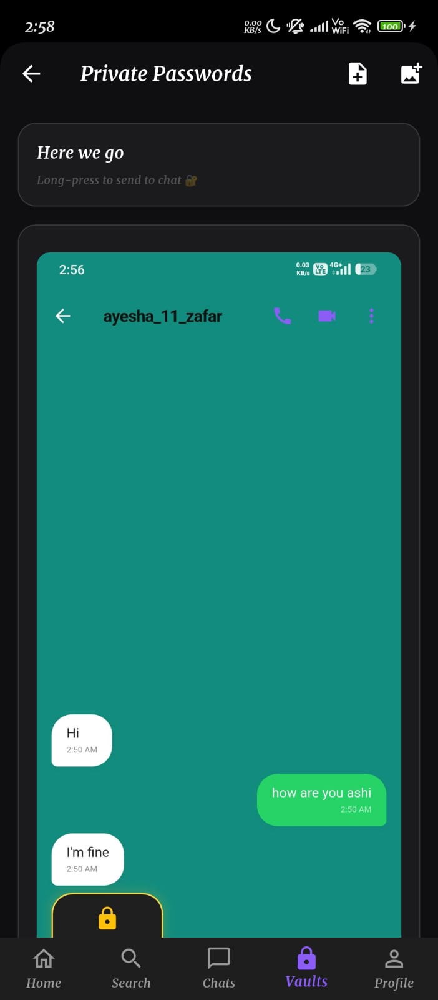
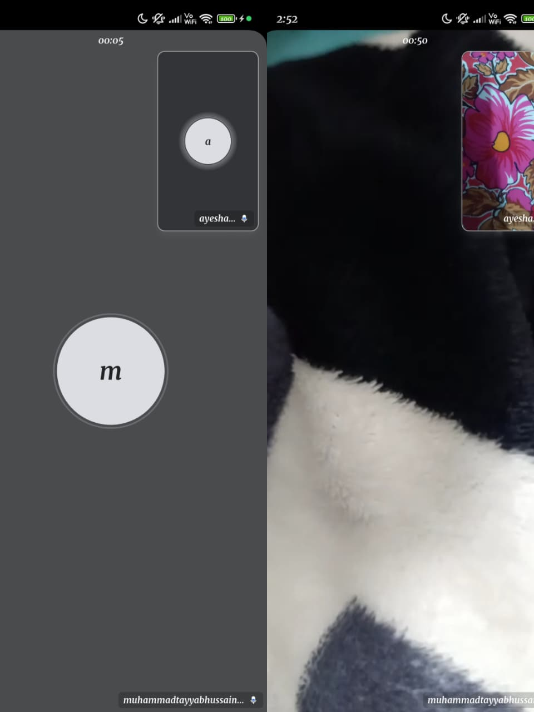

# Aura Messenger 🚀

Aura Messenger is a premium, real-time secure messaging and social networking platform engineered using Flutter and Firebase. Combining the sleek aesthetics of Instagram with the robust communication features of WhatsApp, Aura delivers high-contrast custom theming, time-locked ephemeral messages, and a decentralized PIN-protected Vault for ultimate privacy.

## ✨ Core Features
*   📱 **Social Feed & Stories:** Share 24-hour ephemeral stories and permanent global posts (with likes and viewers analytics).
*   💬 **Advanced Real-Time Chat Engine:** Instant messaging with WhatsApp-style interface mapped in real-time via Firestore.
*   🔐 **Decentralized Secure Vaults:** A 4-Digit Master PIN protected subcollection for storing highly encrypted Base64 image files and hidden text notes away from prying eyes.
*   ⏳ **Time-Locked Messages:** Set self-destruct timers (10s, 1min) on specific chat bubbles. Messages are brutally deleted from both local client and backend server upon expiration.
*   🎨 **Per-Chat Theming & Wallpapers:** Break out of standard constraints and apply customized gradient or physical wallpaper aesthetics (like Sunset, Monochrome, Cyberpunk) on a per-chat basis!
*   🌗 **Seamless State Dynamics:** Elegant light/dark modes fully mapped over `Riverpod` global state.

## 🛠 Tech Stack & Architecture
*   **Frontend Framework:** Flutter (Dart)
*   **State Management:** `flutter_riverpod` (Notifier architecture)
*   **Backend as a Service:** Firebase (Auth, Firestore)
*   **Media Architecture:** Physical Base64 encryption bridging over native device storage to bypass cloud rate limits and enforce extreme local network privacy.

## ⚙️ Build Instructions
1.  Verify you have the Flutter SDK configured.
2.  Run `flutter clean` then `flutter pub get`.
3.  Deploy logic to a real physical device: `flutter run --release`
4.  Export production APK: `flutter build apk` (Generates optimized binary < 50MB)

## 📸 Application Gallery
Here is a showcase of the core architecture and UI/UX flowing seamlessly:

| The Main Hub (Social Feed) | Private Account & Profile | Activity & Follow Engine |
| :---: | :---: | :---: |
|  |  |  |

| Active Real-Time Chat | Ephemeral Secure Vault Media | 4-Digit Vault PIN Engine | WebRTC Native Video Call |
| :---: | :---: | :---: | :---: |
|  |  |  |  |

---
*Developed & Designed by Ayesha Zafar*
